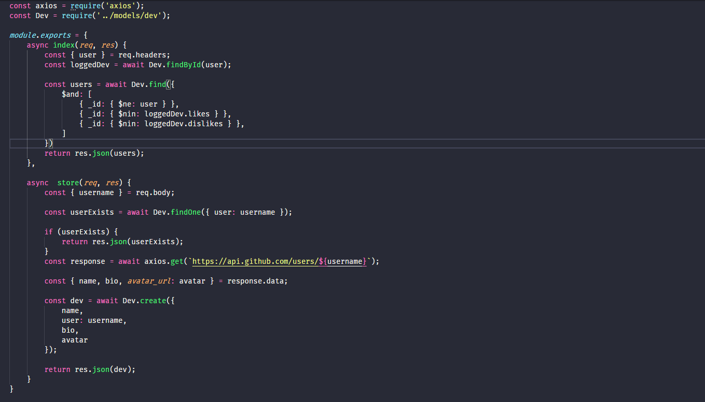

# TinDev Backend

Projeto desenvolvido na semana OmniStack 8 da Rocketseat utilizando NodeJS e MongoDB.

## Objetivos

Os objetivos deste projeto são:

Introduzir os conceitos básicos do NodeJS.
Utilizar o NPM, Express, Routes, Axios e Socket IO (Web Socket).
Exemplificar implementação de serviços REST com NodeJS.

## Instalação

```bash
# Primeiramente clone o repositório 
https://github.com/JonasYo/tindev-backend.git

# Navegue até o diretório
cd tindev-backend

# Instale as dependências NPM
npm install
```

 

## Contribuições
Pull requests são bem-vindos.

## License
[MIT](https://choosealicense.com/licenses/mit/)
